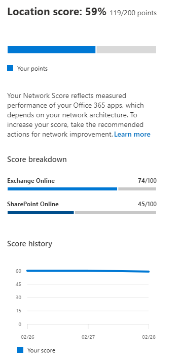

# Microsoft 365 network assessment (preview)

In the Microsoft 365 Admin Center's Connectivity to Microsoft 365 page, **network assessments** distill an aggregate of many network performance metrics into a snapshot of your enterprise network health, represented by a points value from 1 - 100. Network assessments are scoped to both the entire tenant and for each geographic location from which users connect to your tenant, providing Microsoft 365 administrators with an easy way to instantly grasp a gestalt of the enterprise's network health and quickly drill down into a detailed report for any global office location.

The network assessment points value is an average measurement of latency, bandwidth, download speed and connection quality metrics compiled live at the time they are viewed. Performance metrics for Microsoft-owned networks are excluded from these measurements to ensure that assessment results are unambiguous and specific to the corporate network.

A very low network assessment value suggests that Microsoft 365 clients will have significant problems connecting to the tenant or maintaining a responsive user experience, while a high value indicates a properly configured network with few ongoing performance issues. A value of 80% represents a healthy baseline where you should not expect to receive regular user complaints about Microsoft 365 connectivity or responsiveness due to network performance. As iterative network connectivity improvements are made, this value will increase along with user experience.

>[!IMPORTANT]
>Network insights, performance recommendations and assessments in the Microsoft 365 Admin Center is currently in preview status, and is only available for Microsoft 365 tenants that have been enrolled in the feature preview program.

## Network assessment panel

Each network assessment, whether scoped to the tenant or to a specific office location, shows a panel with details about the assessment. This panel shows a bar chart of the assessment both as a percentage and as the total points for each component workload including only workloads where measurement data was received. For an office location network assessment, we also show a benchmark which is the median of all Microsoft 365 clients that reported data in the same city as your office location.

The **Assessment breakdown** in the panel shows the assessment for each of the component workloads.

The **Assessment history** shows the past 30 days of the assessment and the benchmark.

## Tenant network assessments and office location network assessments

A network assessment measures the design of the network perimeter of an office location to Microsoft's network. Improvements to the network perimeter is best done at each office location, or where network connectivity is aggregated there may be improvements that impact multiple locations.

We show a network assessment value for the whole Microsoft 365 tenant on the network performance overview page and a specific value for each detected office location on that location's summary page.

## Exchange Online

For Exchange Online the TCP latency from the client machine to the Exchange front end server is measured. This can be impacted by the distance the network travels over the customers LAN and WAN. It can also be impacted by network intermediary devices or services which delay the connectivity or cause packets to be resent.

## SharePoint Online

For SharePoint Online the download speed available for a user to access a document is measured. This can be impacted by the bandwidth available on network circuits between the client machine and Microsoft's network. It is also often impacted by network congestion that exists in bottlenecks in complex network devices or in poor coverage Wi-Fi areas.

## Microsoft Teams

For Microsoft Teams the Network quality is measured as UDP latency, UDP jitter, and UDP packet loss. UDP is used for call and conferencing audio and video media connectivity for Microsoft Teams. This can be impacted by the same factors as for latency and download speed in addition to connectivity gaps in a network's UDP support since UDP is configured separately to the more common TCP protocol.

## Related topics

[Network performance recommendations in the Microsoft 365 Admin Center (preview)](office-365-network-mac-perf-overview.md)

[Microsoft 365 network performance insights (preview)](office-365-network-mac-perf-insights.md)

[Microsoft 365 connectivity test in the M365 Admin Center (preview)](office-365-network-mac-perf-onboarding-tool.md)

[Microsoft 365 Network Connectivity Location Services (preview)](office-365-network-mac-location-services.md)
